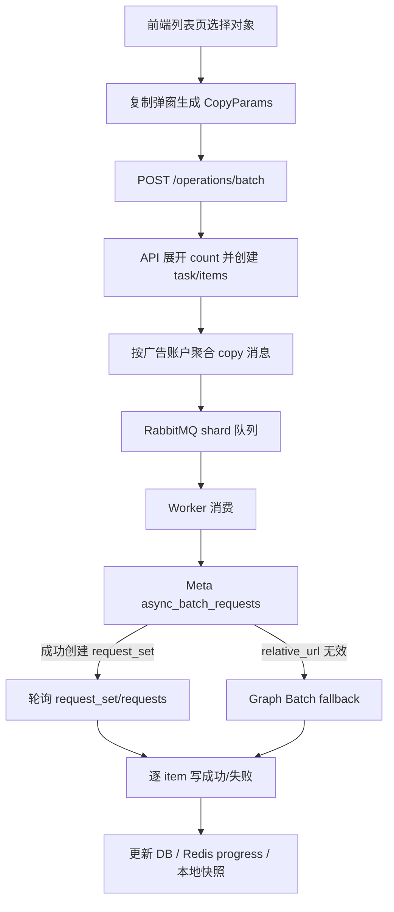

# 批量复制链路梳理

更新时间：2026-05-22

本文档描述当前版本的批量复制链路，重点覆盖广告系列、广告组、广告三层的 `*:copy` 批量操作。当前线上环境使用 `META_API_VERSION=v21.0`。

## 1. 总览



当前实现的核心目标是：前端一次选择多个对象或一次复制 N 份时，API 不再把每个复制请求完全独立打到 Meta，而是先在本地展开为 item，再在 Worker 里尽量合并为 Meta 批量请求。

## 2. 前端入口

相关文件：

- `apps/web/src/components/EntityListView.tsx`
- `apps/web/src/components/CopyDialog.tsx`
- `apps/web/src/lib/api.ts`

链路：

1. 用户在广告系列、广告组、广告列表页勾选对象，点击复制。
2. `CopyDialog` 生成 `CopyParams`，主要字段包括：
   - `count`
   - `startTime`
   - `statusOption`
   - `deepCopy`
   - `renameOptions`
3. `EntityListView.doCopy()` 调用：

```ts
runBatch(`${layer}:copy`, params, copyOpen.ids)
```

4. `api.batchOperations()` 请求：

```http
POST /operations/batch
```

请求结构大致为：

```json
{
  "action": "campaign:copy",
  "params": {
    "count": 5,
    "deepCopy": true,
    "startTime": "2026-05-23T01:00:00.000Z",
    "statusOption": "PAUSED",
    "renameOptions": {
      "rename_suffix": "_20260522_Tv3",
      "rename_strategy": "ONLY_TOP_LEVEL_RENAME"
    }
  },
  "targets": [
    {
      "ad_account_id": "<local-ad-account-uuid>",
      "target_type": "campaign",
      "target_id": "120249643202090210"
    }
  ]
}
```

前端拿到 `taskId` 后，会轮询 `/operations/:taskId` 查看进度。

## 3. API 入队

相关文件：

- `apps/api/src/modules/operation/index.ts`
- `apps/api/src/modules/operation/batch-service.ts`

入口为：

```http
POST /operations/batch
```

主要步骤：

1. 根据 `action` 做权限映射。例如：
   - `campaign:copy` -> `campaign:copy`
   - `adset:copy` -> `campaign:copy`
   - `ad:copy` -> `campaign:copy`
2. 校验 targets 不为空，单次不超过 5000。
3. 如果是 `*:copy`，读取 `params.count` 并展开 item。
   - `count=5`
   - 选中 1 个 campaign
   - 最终生成 5 个 `operation_task_items`
4. 展开时给每个 item 注入：

```ts
_copyIndex: 1..N
```

5. 创建：
   - `operation_tasks`
   - `operation_task_items`
6. 初始化 Redis progress：

```text
task:{taskId}:progress
```

7. 生成 `OperationMessage`。

## 4. API 侧复制消息聚合

相关文件：

- `apps/api/src/modules/operation/batch-service.ts`
- `apps/api/src/lib/rabbitmq-topology.ts`

当前逻辑：

1. 非 fake 模式下，copy action 会进入 `publishMessages()`。
2. 按以下 key 聚合：

```ts
fbAccountId:adAccountId:metaActId:action
```

3. 每组最多 50 个 item 一条 MQ 消息。
4. 如果一组只有 1 个 item，发布普通 `OperationMessage`。
5. 如果一组超过 1 个 item，发布一条带 `copyBatch` 的消息。

`copyBatch` 结构：

```ts
{
  itemId: string;
  targetType: 'campaign' | 'adset' | 'ad';
  targetId: string;
  params: Record<string, unknown>;
  idempotencyKey: string;
}
```

示例：复制同一个 campaign 5 份时，DB 里有 5 个 item，但 RabbitMQ 只发布 1 条消息，这条消息的 `copyBatch.length=5`。

## 5. RabbitMQ

相关文件：

- `apps/api/src/lib/rabbitmq-topology.ts`
- `apps/worker/src/index.ts`

当前拓扑：

- exchange: `ad.ops`
- dlx: `ad.ops.dlx`
- shard queue: `shard.0` 到 `shard.15`
- retry queue:
  - `retry.5s`
  - `retry.30s`
  - `retry.2m`
- failed queue: `ad.ops.failed`

copy/delete 优先级为 3，status/budget 优先级为 8。

Worker 默认：

```text
WORKER_PREFETCH=5
```

如果 Worker 返回 retry：

- `attempt` 默认会 +1。
- `bumpAttempt=false` 时不增加 attempt，例如 async copy pending、限流等待。

## 6. Worker 通用处理

相关文件：

- `apps/worker/src/handler.ts`

Worker 收到消息后：

1. 检查 fb account 和 ad account breaker。
2. 对目标对象加锁。
   - 如果是 `copyBatch`，会对 batch 内所有 `targetId` 加锁。
   - 对同一个 source 复制 N 份时，实际只会锁同一个 source。
3. 读取 token。
   - 优先 Redis `token:{fbAccountId}`。
   - 没有缓存则从 `fb_accounts.access_token_enc` 解密。
4. 设置 task running。
5. 分支执行：
   - 无 `copyBatch`：走单条 copy。
   - 有 `copyBatch.length > 1`：走批量 copy。

当前实现注意点：

- Worker 幂等检查目前读取的是消息主 item，即 `msg.itemId`。
- 对 `copyBatch` 内其他 item 的状态没有逐个做前置过滤。
- 如果手工改库或出现极端半完成状态，可能出现主 item 终态导致整条 batch 被跳过的风险。

## 7. 单条复制路径

相关文件：

- `apps/worker/src/handler.ts`
- `apps/api/src/lib/meta-client.ts`
- `apps/api/src/providers/meta.ts`

单条复制会先尝试 Meta async batch：

```http
POST /v21.0/{act_id}/async_batch_requests
```

表单字段：

```text
name=<request name>
adbatch=[{ relative_url, body, name }]
```

当前 item 格式：

```json
{
  "relative_url": "<sourceId>/copies",
  "body": "deep_copy=true&start_time=...&status_option=PAUSED&rename_options=...",
  "name": "<taskId>_<itemId>"
}
```

如果 Meta 返回：

```text
(#194) param adbatch has too few elements
```

单条复制会 fallback 到同步复制：

```http
POST /v21.0/{sourceId}/copies
```

同步复制成功后，返回 `newId`，并写本地快照。

## 8. 批量复制路径

相关文件：

- `apps/worker/src/handler.ts`
- `apps/api/src/lib/meta-client.ts`

批量复制入口：

```ts
executeAsyncCopyBatchProvider()
```

步骤：

1. 逐个 item 校验 source 是否属于当前广告账户。
   - campaign 查 `account_id`
   - adset 查 `account_id,campaign_id`
   - ad 查 `account_id,campaign_id,adset_id`
2. 将每个 item 转成 `AsyncCopyInput`。
3. request name 使用：

```text
copy_<itemId without hyphens>
```

4. `_copyIndex` 会追加到 `rename_suffix`：

```text
_20260522_Tv3-01
_20260522_Tv3-02
...
```

5. 先提交 Meta async request set。

## 9. Meta async request set

当前请求：

```http
POST /v21.0/{act_id}/async_batch_requests
```

表单：

```text
name=copy_batch_<timestamp>
adbatch=[...]
```

adbatch item：

```json
{
  "relative_url": "120249643202090210/copies",
  "body": "deep_copy=true&start_time=2026-05-23T01%3A00%3A00.000Z&status_option=PAUSED&rename_options=...",
  "name": "copy_037840f7fc98481db750191bce62e970"
}
```

如果创建成功：

1. 保存 `AsyncCopyState` 到 Redis 和 item `error` 字段。
2. 后续 retry 轮询：

```http
GET /v21.0/{requestSetId}?fields=id,name,is_completed,success_count,error_count,canceled_count,in_progress_count,total_count
GET /v21.0/{requestSetId}/requests?fields=id,name,status,result,error,input,type
```

3. 按 request name 匹配结果。
4. 解析新 ID：
   - campaign: `copied_campaign_id`
   - adset: `copied_adset_id`
   - ad: `copied_ad_id`
   - 或 `ad_object_ids[].copied_id`

当前线上观察：

```text
Meta 返回：请求集中提供的 relative_url 是无效的。
```

所以当前批量复制 campaign 时，async request set 会进入 fallback。

## 10. Graph Batch fallback

相关文件：

- `apps/worker/src/handler.ts`
- `apps/api/src/lib/meta-client.ts`

触发条件：

```text
Meta async request set 返回 relative_url 无效
```

fallback 入口：

```ts
executeGraphBatchCopyProvider()
```

当前策略：

1. 将 batch 按 3 条一组切分。
2. 每组调用 Graph Batch。

请求：

```http
POST https://graph.facebook.com?access_token=<token>
```

表单：

```text
include_headers=false
batch=[
  {
    "method": "POST",
    "relative_url": "v21.0/120249643202090210/copies",
    "body": "deep_copy=true&start_time=...&status_option=PAUSED&rename_options=...",
    "name": "copy_037840f7fc98481db750191bce62e970"
  }
]
```

每个子响应：

```ts
{
  code?: number;
  body?: unknown;
}
```

处理逻辑：

- `2xx` 且能解析出 copied id：该 item 成功。
- 非 `2xx`：该 item 失败，错误写入 `operation_task_items.error`。
- `2xx` 但没有 copied id：该 item 失败。

当前线上观察：

`05bf80de`、`5465e249`、`b1578bfc` 都进入了 Graph Batch fallback，但每个子请求都返回：

```text
(#3) Application does not have the capability to make this API call.
```

已确认 token 权限包含：

```text
ads_management
ads_read
business_management
```

因此当前失败点不是 token scope 缺失，也不是 MQ 或服务状态问题，而是 Graph Batch 调用 copy edge 被当前 Meta App 能力限制拒绝。

## 11. 成功和失败回写

成功时：

1. 写本地 copy placeholder：
   - `campaigns`
   - `adsets`
   - `ads`
2. `operation_task_items.status = success`
3. `operation_tasks.success += 1`
4. Redis progress `success += 1`

失败时：

1. `operation_task_items.status = failed` 或 `dead`
2. `operation_task_items.error = <Meta error>`
3. `operation_tasks.failed += 1`
4. Redis progress `failed += 1`

批量 fallback 中，Graph Batch 子请求返回明确业务错误时，当前直接标记为 failed，不再进入 retry 队列。

## 12. 任务查询和前端进度

相关文件：

- `apps/api/src/modules/operation/query-service.ts`
- `apps/api/src/lib/progress.ts`

前端轮询：

```http
GET /operations/:taskId
```

返回：

- `total`
- `success`
- `failed`
- `status`
- `failures`

`failures` 最多返回 50 条 failed/dead item。

Redis progress 优先于 DB progress，用于前端实时展示；任务终态后 Redis progress 保留 15 分钟。

## 13. 当前线上失败样例

### b1578bfc

```text
task_id: b1578bfc-2b59-4e22-b722-c342b71e4828
action: campaign:copy
total: 5
success: 0
failed: 5
source campaign: 120249643202090210
ad account: act_1185412366848999
```

执行日志摘要：

```text
[meta-async-copy] submit account=act_1185412366848999 requests=5 ...
[meta-copy-batch] async request set rejected relative_url; falling back to Graph batch task=b1578bfc...
[meta-copy-batch] submit requests=3 ...
[meta-copy-batch] submit requests=2 ...
```

DB item 错误：

```text
(#3) Application does not have the capability to make this API call.
```

结论：

```text
当前版本已经从 async request set fallback 到 Graph Batch，但 Graph Batch 调 copy edge 被 Meta App 能力限制拒绝。
```

## 14. 当前判断

目前批量复制链路已经能做到：

- 前端批量提交。
- API 展开 count。
- DB task/item 落库。
- MQ 聚合同广告账户 copy item。
- Worker 统一消费。
- async request set 尝试。
- relative_url 无效时 fallback Graph Batch。
- 每个 item 独立写成功/失败。

当前没有解决的是：

- Meta async request set 不接受当前 `relative_url: <sourceId>/copies`。
- Graph Batch copy edge 返回 `(#3) Application does not have the capability to make this API call`。
- 也就是说，当前失败卡在 Meta App/API 能力限制层，不是系统内部链路没有跑通。

## 15. 下一步需要确认的问题

建议下一步只确认一个方向，避免继续盲改：

1. Meta v21 是否存在专门的 async copy edge，而不是 `async_batch_requests + /copies`。
2. 当前 Meta App 是否允许 Graph Batch 调 Marketing API 的 copy edge。
3. `(#3)` 是否来自 App Review/Advanced Access/Business capability，而不是用户 token scope。
4. 是否改成后端顺序同步复制，每次最多 3 个真实 copy 请求，并通过 MQ 慢慢跑，而不是 Graph Batch。

如果选择第 4 个方案，系统链路会变成：

```text
前端一次提交 5 个
API 展开 5 个 item
Worker 不走 Graph Batch
Worker 按 item 顺序调用 POST /{sourceId}/copies
用 MQ / rate limit 控制节奏
```

这个方案不依赖 Graph Batch 能力，但是否会触发 Meta “同时复制总数不能超过 3” 需要在线上实测。
