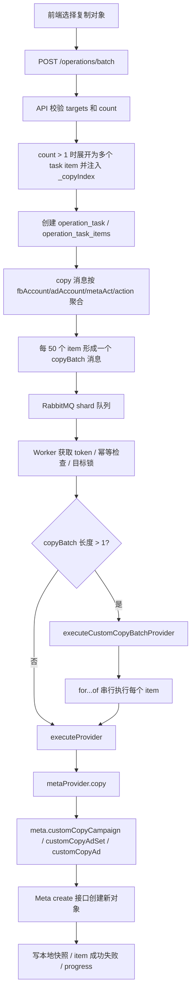

# 当前复制流程：串行自建复制

更新时间：2026-05-22

## 结论

当前生产复制链路已经不是 Meta `/{object_id}/copies`、`async_batch_requests` 或 Graph Batch 批量复制主路径，而是项目内自建的 create-copy 流程。

批量复制在 Worker 的单个 `copyBatch` 聚合消息内是串行执行的：`executeCustomCopyBatchProvider()` 对 `copyItems` 使用 `for...of`，每个 item 都 `await executeProvider()` 完成后才处理下一个 item。

需要注意：这不是全局单线程。RabbitMQ 仍有 shard/consumer，不同消息、不同分片仍可能并发；这里只确认“同一个聚合 copyBatch 消息内部”是串行。

## 为什么改成当前方案

之前尝试过 Meta 官方 copy edge：

- 单对象 copy：`/{source_id}/copies`
- Async Batch copy：`async_batch_requests`
- Graph Batch fallback：批量提交 `v21.0/{source_id}/copies`

线上返回过：

```text
(#3) Application does not have the capability to make this API call
```

因此当前方案绕开 copy edge，改为读源对象字段后调用 Meta create 接口重新创建对象：

- Campaign：`POST /{act_id}/campaigns`
- AdSet：`POST /{act_id}/adsets`
- Ad：`POST /{act_id}/ads`

## 总体链路



## API 入队流程

入口：`apps/api/src/modules/operation/batch-service.ts`

1. `batchEnqueue()` 接收 `action`、`params`、`targets`。
2. `targets` 必须非空，单次不超过 5000。
3. copy 类 action 支持 `params.count`：
   - `count` 被限制在 `1..200`。
   - `count > 1` 时，每个 target 被展开为 N 个 task item。
   - 每个展开 item 注入 `_copyIndex: 1..N`，用于幂等和命名区分。
   - 展开后总 item 数仍不能超过 5000。
4. API 创建 task/items 后生成 `OperationMessage`。
5. `publishMessages()` 对 copy action 做聚合：
   - 聚合 key：`fbAccountId:adAccountId:metaActId:action`
   - 每组最多 50 个 item 打包为一个 `copyBatch`
   - 如果 chunk 只有 1 个 item，则按普通单条消息发布

## Worker 执行流程

入口：`apps/worker/src/handler.ts`

Worker 收到消息后先做通用处理：

1. 检查 breaker。
2. 对当前消息涉及的目标对象加操作锁：
   - 普通消息锁 `msg.targetId`
   - `copyBatch` 消息锁 batch 内全部 `targetId`
3. 检查 task item 幂等状态，已经 `success` / `failed` / `dead` 的 item 不重复执行。
4. 解密或读取缓存 token。
5. 设置 task running。

copy 分支：

```ts
if (msg.copyBatch && msg.copyBatch.length > 1) {
  result = await executeCustomCopyBatchProvider(msg, token, copyItemsForMessage(msg));
} else {
  result = await executeProvider(msg, token);
}
```

`executeCustomCopyBatchProvider()` 是当前批量复制串行性的关键：

```ts
for (const item of copyItems) {
  const itemMsg = messageForCopyItem(msg, item);
  const result = await executeProvider(itemMsg, token);
  await writeLocalBestEffort(itemMsg, token, result);
  await markSuccess(itemMsg, result);
  await bumpProgress(itemMsg.taskId, { success: 1 });
}
```

单个 item 失败时只标记该 item 失败并增加 failed progress，不会中断整个 batch 后续 item。

## Provider 复制路径

入口：`apps/api/src/providers/meta.ts`

`metaProvider.copy()` 当前直接调用 custom copy：

- `campaign` -> `meta.customCopyCampaign()`
- `adset` -> `meta.customCopyAdSet()`
- `ad` -> `meta.customCopyAd()`

当前同账号复制为主：

- Campaign 如果传了 `targetAdAccountId` 且不同于当前 `adAccountId`，会返回 422。
- AdSet 可以指定 `targetCampaignId`，否则复制到源 adset 的 campaign。
- Ad 可以指定 `targetAdSetId`，否则复制到源 ad 的 adset。

## Meta 自建复制细节

入口：`apps/api/src/lib/meta-client.ts`

### Campaign copy

`customCopyCampaign()`：

1. 读取源 campaign 字段。
2. 用 `POST /{act_id}/campaigns` 创建新 campaign。
3. 如果 `deepCopy !== false`：
   - 列出源 campaign 下的 adsets。
   - 逐个 `createAdSetFromSource()` 创建到新 campaign。
   - 对每个源 adset 列出 ads。
   - 逐个 `createAdFromSource()` 创建到新 adset。

### AdSet copy

`customCopyAdSet()`：

1. 读取源 adset 字段。
2. 目标 campaign 使用 `targetCampaignId`，未传则使用源 `campaign_id`。
3. 用 `POST /{act_id}/adsets` 创建新 adset。
4. 如果 `deepCopy !== false`，逐个复制源 adset 下的 ads。

### Ad copy

`customCopyAd()`：

1. 读取源 ad 字段。
2. 目标 adset 使用 `targetAdSetId`，未传则使用源 `adset_id`。
3. 用 `POST /{act_id}/ads` 创建新 ad。
4. 同账号复制时复用源广告的 `creative.id`：

```json
{
  "creative": { "creative_id": "<source_creative_id>" }
}
```

如果源 ad 缺少 creative id，会返回错误，不能自建复制。

## 命名和状态规则

命名由 `renameOptions` 控制：

- `NO_RENAME`：保持原名。
- `ONLY_TOP_LEVEL_RENAME`：只改顶层对象名，深拷贝出来的子对象保持原名。
- 未提供 prefix/suffix 时默认使用 `Copy of <原名>`。
- 有 `rename_prefix` / `rename_suffix` 时使用 `<prefix><原名><suffix>`。

批量复制的 `_copyIndex` 会追加到 `rename_suffix`：

```text
原 rename_suffix: _test
_copyIndex: 1
最终 rename_suffix: _test-01
```

这样一次复制多份时名称会变成：

```text
<原名>_test-01
<原名>_test-02
...
```

状态规则：

- 默认创建为 `PAUSED`。
- `statusOption=ACTIVE` 时创建为 `ACTIVE`。
- `statusOption=INHERITED_FROM_SOURCE` 时，只有源对象是 `ACTIVE` 才创建为 `ACTIVE`，否则仍为 `PAUSED`。

## 写回和进度

每个 item 完成后 Worker 会分别处理：

- `writeLocalBestEffort()`：尽力写入本地广告对象快照，让前端能看到新 ID。
- `markSuccess()`：把当前 task item 标为成功，并记录 result。
- `failItem()`：单 item 失败时记录失败原因。
- `bumpProgress()`：更新 task 的 success / failed 计数。

批量消息函数最后返回：

```ts
{ __batchHandled: true }
```

表示 batch 内每个 item 已经单独完成成功/失败写回，外层不再把聚合消息当成一个普通 item 重复结算。

## 当前仍存在的旧代码

代码里仍保留了一些历史 async copy / Graph Batch helper：

- `executeAsyncCopyProvider()`
- `executeAsyncCopyBatchProvider()`
- `meta.copyBatch()`
- `meta.copyCampaign()` / `copyAdSet()` / `copyAd()` 中的 `/{id}/copies`

但当前 copy 主路径没有调用这些函数：

- Worker copy 分支调用的是 `executeCustomCopyProvider()` / `executeCustomCopyBatchProvider()`。
- Provider 调用的是 `customCopyCampaign()` / `customCopyAdSet()` / `customCopyAd()`。

后续清理时可以删除或隔离旧 async 路径，避免误读。

## 已知限制

- 当前按同账号复制验证通过，跨广告账号复制未完整支持。
- 批量复制为串行执行，吞吐量低于并发复制，但更容易避开 Meta capability、限流和复杂失败恢复问题。
- Campaign 深拷贝会按 campaign -> adset -> ad 逐层串行创建；源对象层级越大，耗时越长。
- Ad 复制依赖源 ad 的 creative id；缺失 creative id 时无法创建。
- 本地快照写入是 best-effort，Meta 创建成功但本地写快照失败时，需要通过后续同步补齐。

## 线上验证记录

2026-05-22 已验证：

- `campaign:copy count=2`
  - task：`97583c67-bfb3-4660-818e-d760e5c46817`
  - 结果：`success=2 failed=0`
  - 新 campaign：`120249701965530210`、`120249701974260210`
- `adset:copy count=10`
  - task：`6d55e02a-c2f8-44c4-8bab-34cc243b828a`
  - 结果：`success=10 failed=0`

最终部署 release：`20260522230432`。
