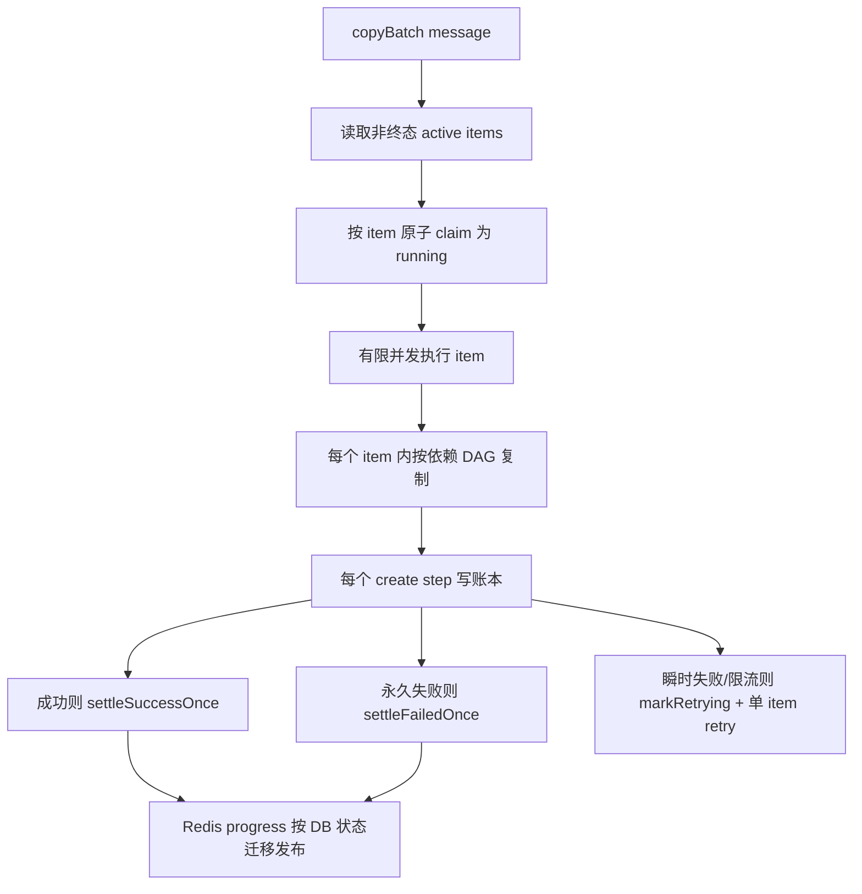

# 批量复制并行异步改造计划

更新时间：2026-05-22

## 目标

当前 `copyBatch` 内部是串行执行，效率偏低。

本计划目标是把复制改造成有限并发、异步可恢复的执行模型，并保证：

- 同一个 task item 最终只结算一次。
- 同一个 task item 的 top-level 新对象只创建一次。
- campaign 深拷贝时，源 campaign / adset / ad 到新 campaign / adset / ad 的映射正确，不串父子关系。
- Worker 重试、RabbitMQ 重投、进程崩溃、Meta 5xx/timeout 后不会轻易重复创建。
- 进度 `success + failed` 不会重复累加，不会超过 `total`。

## 当前链路说明

> ⚠️ **重要前提**：当前复制仍然调用 Meta 的复制 API，并非项目内自建 create-copy。
>
> 具体调用链为：
> `handle()` → `executeCustomCopyBatchProvider()` → `executeProvider()` → `executeCustomCopyProvider()` → `metaProvider.copy()` → Meta `/{object_id}/copies`（或 copy edges）
>
> "custom" 指的是自建的批次管理逻辑，不是绕开 Meta copy API 手动创建对象。

当前还存在一段未接入主路径的异步批量代码 `executeAsyncCopyBatchProvider()`（使用 Meta async request set API），由于切换到自定义批次管理路径后未清理，是**死代码**，实现新方案时注意区分，必要时可删除或明确标注。

## 当前瓶颈和风险

当前串行瓶颈在 `apps/worker/src/handler.ts`，实际代码如下（已简化无关细节）：

```ts
async function executeCustomCopyBatchProvider(msg, token, copyItems) {
  for (const item of copyItems) {
    const itemMsg = messageForCopyItem(msg, item);
    const status = await readItemStatus(item.itemId);
    if (isTerminalStatus(status)) continue;          // ← 已有终态跳过

    try {
      const result = await executeProvider(itemMsg, token);  // ← 仍调 Meta copy API
      await writeLocalBestEffort(itemMsg, token, result);
      await markSuccess(itemMsg, result);             // ← 无条件 +1，见风险2
      await bumpProgress(itemMsg.taskId, { success: 1 });
    } catch (err) {
      await failItem(itemMsg, message);              // ← 无条件 +1，见风险2
      await bumpProgress(itemMsg.taskId, { failed: 1 });
    }
  }
}
```

已有保护：
- `readItemStatus()` + `isTerminalStatus()` 跳过已终态 item（重复投递时有效）。
- 外层 `handle()` 有幂等查重（step 3），但只对整条消息级别。

**当前已识别风险：**

**风险 1 — 无 item 级 claim，并行后同一 item 可能被多个 worker 并发执行**

当前串行不触发此问题，但并行后，若同一消息被多次投递或两个 worker 并发处理，`readItemStatus()` 检查和实际执行之间存在 TOCTOU 窗口。

**风险 2 — `markSuccess()` / `failItem()` 不是幂等的**

两个函数直接做 `success + 1` / `failed + 1`，没有按"状态从非终态变终态"做条件更新。并行后若同一 item 被重复结算，`operation_tasks` 计数器会超出 `total`。

**风险 3 — rate limit 按消息粒度 acquire，并行后 Meta 请求数不受控**

`handle()` 在步骤 4 对整条消息只 acquire 一次令牌桶，内部串行多个 item 共用这一次获取。并行后每个 item 需独立 acquire。

**风险 4 — Meta 已创建对象但 Worker 在写 DB 前崩溃**

Meta copy API 不对外暴露可用的幂等 key。崩溃后重试无法识别已创建对象，会重复 create。

## 推荐架构

采用"有限并发 + item 级状态机 + copy step 账本 + 可恢复 marker"的方案。



并发只放开独立单元：

- copyBatch 内多个 item 可以并发。
- 单个 campaign 深拷贝内部，必须先创建 campaign，再并发创建 adsets，再在各自 adset 下并发创建 ads。
- 父对象未成功落账前，不创建子对象。

## 深拷贝实现路线说明

> ⚠️ **关键决策点**：当前 `metaProvider.copy()` 已支持 deep copy（`deepCopy=true`），Meta 侧负责复制 adsets 和 ads，我们收到一个 `newId`（顶层 campaign 的新 ID）。
>
> 计划中描述的 campaign→adset→ad 手建 DAG，是**绕开 Meta native deep copy、手动逐层 create** 的全新方案，需要：
> 1. `meta-client` 增加 `createCampaign` / `createAdSet` / `createAd` 接口。
> 2. worker 实现 DAG 执行逻辑和子对象 ID 映射。
> 3. 放弃依赖 Meta copy 返回的 `newId` 作为单一锚点。
>
> 这是显著更大的改动范围，建议在 **Phase 2+** 的 copy step 账本完成后再评估是否采用。**Phase 1–2 可以先保留 `metaProvider.copy()` 调用，只加 step 账本保护顶层 create 的幂等性。**

并发只放开独立单元：

- copyBatch 内多个 item 可以并发（不依赖 Meta 完成顺序）。
- 如果后期采用手建 DAG，单 campaign copy 内部：先建 campaign，再并发建 adsets，再在各 adset 下并发建 ads；父未落账不建子。

## 并发控制

不要用无界 `Promise.all()`。新增有限并发执行器，建议配置：

```text
COPY_BATCH_ITEM_CONCURRENCY=3        # 单个 copyBatch 内同时处理的 item 数（信号量）
COPY_CHILD_ADSET_CONCURRENCY=2       # 单个 campaign 手建 DAG 时同时创建 adset 数（手建 DAG 启用后才有效）
COPY_CHILD_AD_CONCURRENCY=4          # 单个 adset 下同时创建 ad 数（手建 DAG 启用后才有效）
```

> **注意：与现有 Redis 令牌桶的区别**
>
> - `COPY_BATCH_ITEM_CONCURRENCY` 是**信号量**（同时执行数上限），控制本进程内并发度。
> - 现有 Redis `ratelimit:adacct:{metaActId}` 是**令牌桶**（速率上限，tokens/s），两者互补，不重复。
> - 并行后每个 Meta 请求需独立 acquire Redis 令牌桶，不再在消息级统一 acquire 一次。

上线初期建议保守：

```text
COPY_BATCH_ITEM_CONCURRENCY=2
COPY_CHILD_ADSET_CONCURRENCY=1
COPY_CHILD_AD_CONCURRENCY=2
```

确认稳定后再逐步提高。

保留一键回滚能力：

```text
COPY_BATCH_ITEM_CONCURRENCY=1
COPY_CHILD_ADSET_CONCURRENCY=1
COPY_CHILD_AD_CONCURRENCY=1
```

上述配置应退化为当前串行行为。

## Item 级状态机

并行前必须先把 item 执行变成"可 claim、只结算一次"。

> **注意**：`retrying` 状态已在 `incAttempts()` 中使用，Phase 1 要做的是把 claim 从"读后跳过"升级为"原子写 running"，并保证结算函数条件更新。

### Claim

每个 item 执行前先原子 claim：

```sql
UPDATE operation_task_items
SET status = 'running', attempts = :attempt
WHERE id = :itemId
  AND status IN ('pending', 'retrying')
RETURNING id;
```

没有返回行说明 item 已被其他执行器处理或已经终态，当前 worker 直接跳过。

### 成功结算

成功时只允许从非终态迁移到 `success`，并且只有真实迁移成功才增加 task counter：

```sql
UPDATE operation_task_items
SET status = 'success', attempts = :attempt, error = :resultJson
WHERE id = :itemId
  AND status NOT IN ('success', 'failed', 'dead')
RETURNING id;
```

只有返回行时才执行：

```sql
UPDATE operation_tasks SET success = success + 1 ...
```

Redis `bumpProgress()` 也必须只在 DB counter 真实变化后调用。

### 失败结算

永久失败同理，只允许迁移一次：

```sql
UPDATE operation_task_items
SET status = :failedOrDead, attempts = :attempt, error = :message
WHERE id = :itemId
  AND status NOT IN ('success', 'failed', 'dead')
RETURNING id;
```

只有返回行时才 `failed + 1` 和 `bumpProgress({ failed: 1 })`。

### 可重试失败

Meta 429、限流、网络 timeout、5xx 这类瞬时失败不要直接计入 failed：

- item 状态设为 `retrying`（`incAttempts()` 已有此逻辑，保持不变）。
- attempts 增加。
- 发布该 item 的 retry 消息，或保留 batch retry 但重试时必须跳过已终态 item。
- 不增加 task success/failed counter。

建议从"batch 整体 retry"逐步改成"item 独立 retry"，否则一个 item 限流会拖住同一 batch 中所有 item。

## Copy Step 账本

为了保证复制结果正确且不重复，需要新增复制步骤账本。建议新增表：

```text
operation_copy_steps
  id
  task_item_id
  step_key           -- 确定性 key，格式见下，已包含 item_id
  source_type        campaign/adset/ad
  source_id
  target_type        campaign/adset/ad
  parent_step_key    -- 父对象 step_key，用于恢复父子映射
  new_id             -- Meta 返回的新对象 id
  desired_name       -- 用户期望的最终名称
  marker_name        -- 创建时使用的临时标记名
  status             pending/running/success/unknown/failed
  lease_until        -- running 状态超时时间，防止 worker 崩溃后 step 永远卡 running
  error
  created_at
  updated_at
```

唯一约束：

```text
UNIQUE(task_item_id, step_key)
```

> **说明**：只需一个唯一约束。`step_key` 格式已内含 `itemId`（见下），因此 `(task_item_id, step_key)` 已足够唯一。
> 不需要再加 `UNIQUE(idempotency_key, step_key)`——`idempotency_key` 是 item 级属性，不是 step 级属性，加在此处语义模糊且冗余。

`step_key` 必须确定性生成：

```text
campaign top-level: item:<itemId>:campaign:<sourceCampaignId>
adset child:        item:<itemId>:adset:<sourceAdSetId>
ad child:           item:<itemId>:ad:<sourceAdId>
```

同一个源对象复制多份时，因为 API 已经把 `_copyIndex` 展开成不同 item，`itemId` 不同，所以 step key 不冲突。

执行每个 Meta create 前：

1. 先查 step。
2. step 已 `success` 且有 `new_id`：直接复用，不再创建。
3. step 是 `running` 且 `lease_until` 未过期：跳过或稍后重试（说明另一 worker 或同一 worker 的上一次执行还在进行中）。
4. step `running` 但 lease 已过期：视为 `unknown`，进入 marker 恢复流程（见下）。
5. step 不存在：插入 `running` reservation，设置 `lease_until`。
6. Meta create 成功后，立刻写 `new_id` 和 `success`，清除 lease。

## 崩溃恢复和防重复策略

仅靠本地账本仍不能完全覆盖这个窗口：

```text
Meta create 成功 -> Worker 崩溃 -> new_id 还没写入 DB
```

推荐加入可恢复 marker：

1. 每个 step 生成一个唯一 `marker_name`：

```text
<desired_name>__copy_marker_<shortStepHash>
```

2. 创建 Meta 对象时先使用 `marker_name`。
3. create 返回 `new_id` 后立即写入 `operation_copy_steps`，step 标为 `success`。
4. step 成功落账后，再把对象 rename 成用户期望的 `desired_name`。
5. **rename 失败的处理**：rename 本身也可能失败（Meta 5xx/timeout）。建议：
   - rename 失败时记录日志，但**不回滚 step 状态**（对象已成功创建，`new_id` 有效）。
   - 将 rename 状态单独存储（step 表加 `rename_status` 列，或单独队列异步重试）。
   - 前端展示时可提示"名称待更新"，不影响功能使用。
   - 不要因为 rename 失败就将整个 step 标为 failed，否则会重复创建对象。
6. 如果 create 请求 timeout/5xx，不能马上再次 create；先把 step 标为 `unknown`，lease 置空。
7. retry 时先用 `marker_name` 查询 Meta（在对应广告账户下按名称过滤）：
   - 找到唯一对象：补写 `new_id`，step 恢复为 `success`，继续后续复制/rename。
   - 找到多个对象（同名 marker 冲突）：保留创建时间最早的对象，其余标记人工介入清理；不能静默成功。
   - 找不到对象：等待短暂 backoff 后再次查询；超过恢复窗口（建议 5 分钟）再重新 create。

> **关于 Meta 远端幂等 key**：如果后续确认 Meta 对当前 create edge 支持可靠的幂等参数（如 `request_batch_id`），可以用远端 idempotency 替代 marker 方案；确认前不应假设存在，保留 marker 策略。

## 深拷贝依赖模型（仅在采用手建 DAG 方案后适用）

> 以下内容仅适用于决策采用手建 DAG 替代 `metaProvider.copy()` 的情况。
> 如果继续使用 Meta native copy，只需保证顶层 campaign/adset/ad 的 step 账本幂等即可，无需手建父子映射。

### Campaign

campaign copy 的执行 DAG：

```text
create campaign
  -> list source adsets
  -> create adsets in limited parallel
      -> list source ads for each adset
      -> create ads under the corresponding new adset in limited parallel
```

关键约束：

- 新 adset 的 `campaign_id` 必须使用当前 item 创建出的 new campaign id。
- 新 ad 的 `adset_id` 必须使用对应源 adset 映射出的 new adset id。
- 子对象 step 成功后必须记录 `parent_step_key`，方便恢复时重建父子映射。

### AdSet

adset copy：

```text
create adset
  -> if deepCopy !== false
     -> list source ads
     -> create ads under new adset in limited parallel
```

### Ad

ad copy：

```text
read source ad
  -> create ad under target/source adset
```

同账号复制继续复用 `creative_id`。

## Rate Limit 和熔断

并行后必须把限流从"消息级 acquire 一次"改成"每个 Meta 请求独立 acquire"。

当前已有 Redis token bucket：

- app bucket：`ratelimit:app`
- ad account bucket：`ratelimit:adacct:{metaActId}`

计划调整：

1. 每次 Meta GET/POST 前都 acquire app + ad account bucket（已有，只需确保并行路径不绕过）。
2. 并行后不能在 `handle()` 入口统一 acquire 一次，改为在每个 item 的 Meta 调用前 acquire。
3. 成功或失败响应后调用 `adjustFromMetaHeaders()`，根据 `X-Ad-Account-Usage` / `X-Business-Use-Case-Usage` 动态收紧桶速率。
4. 命中 Meta 限流时：
   - 打开 ad account breaker。
   - 停止调度新的 copy item。
   - 已成功 item 正常结算。
   - 未开始或瞬时失败 item 标记为 `retrying`，不计入 failed。

不要因为一个并发分支限流，就把整个 batch 里已经成功的 item 或未开始的 item 全部标记 failed。

## Worker 执行模型

新增 `executeParallelCopyBatchProvider()`，替代当前串行函数。

伪代码：

```ts
async function executeParallelCopyBatchProvider(msg, token, copyItems) {
  const active = await readNonTerminalItems(copyItems);
  const limit = createLimiter(env.copyBatchItemConcurrency);

  await Promise.allSettled(
    active.map((item) => limit(async () => {
      const itemMsg = messageForCopyItem(msg, item);
      const claimed = await claimItem(itemMsg);  // 原子 claim，失败说明已被处理
      if (!claimed) return;

      try {
        // 每个 Meta 请求前独立 acquire 令牌桶
        await acquireRateLimitForItem(msg.metaActId);
        const result = await executeCopyItemWithLedger(itemMsg, token);
        await writeLocalBestEffort(itemMsg, token, result);
        await settleSuccessOnce(itemMsg, result);  // 条件更新，只在状态迁移时 +1
      } catch (err) {
        if (isRetryable(err)) {
          await markRetryingAndPublishRetry(itemMsg, err);  // 不计 failed
        } else {
          await settleFailedOnce(itemMsg, err);             // 条件更新，只在状态迁移时 +1
        }
      }
    }))
  );

  return { __batchHandled: true };
}
```

要求：

- 用 `Promise.allSettled()`，避免一个分支失败导致其他分支结果丢失。
- 每个 item 自己负责成功、失败或 retry。
- 外层 batch 消息只负责 ack，不再把 item 级错误交给 `handleErr()` 做整批失败。
- batch 内日志要带 `taskId`、`itemId`、`copyIndex`、`sourceId`、`newId`、`stepKey`。

## API 入队侧调整

入队侧可以先保持不变：

- `count` 继续展开为多个 task item。
- `_copyIndex` 继续用于命名 suffix。
- copyBatch 仍每 50 个 item 聚合。

后续可选优化：

- 根据预计 child 数调整 chunk size，深拷贝 campaign 不一定适合 50 个 item 一批。
- 对超大 campaign copy，API 可以生成更小 chunk，避免单个 batch 消息持有太久。

## 数据一致性验收标准

必须满足：

- 任意 task：`operation_tasks.success + operation_tasks.failed <= operation_tasks.total`。
- task 终态时：`success + failed = total`。
- 每个成功 item 的 result 中只有一个 top-level `newId`。
- 同一个 `task_item_id + step_key` 只有一个 `new_id`。
- campaign deep copy 后（如采用手建 DAG）：
  - 每个源 adset 对应一个新 adset。
  - 每个源 ad 对应一个新 ad。
  - 新 ad 的 parent adset 是该 item 内源 adset 映射出来的新 adset。
- 触发 retry 后，已 success item 不再调用 Meta create。
- Worker 重启后，从 copy step 账本恢复，不重复创建已落账 step。

## 测试计划

### 单元测试

- `claimItem()`：并发 claim 同一个 item，只有一个成功。
- `settleSuccessOnce()`：重复调用不会重复增加 success。
- `settleFailedOnce()`：重复调用不会重复增加 failed。
- `markRetrying()`：不改变 success/failed counter。
- `_copyIndex` 仍正确追加到 rename suffix。
- step key 生成稳定，不同 `_copyIndex` 不冲突。
- rename 失败时 step 仍保持 success，new_id 不丢失。

### Fake Meta 集成测试

- `campaign:copy count=50 deepCopy=true`，验证 success=50、failed=0、新 ID 不重复。
- `adset:copy count=200 deepCopy=true`，验证 task progress 不超 total。
- 模拟某些 item 永久失败，验证其余 item 成功，task 最终 partial。
- 模拟 Worker 在 step success 写入前崩溃重启，验证通过 marker 恢复后不重复创建。
- 模拟 rename 失败，验证 new_id 保留、step 保持 success。
- 并发 claim 测试：同一 copyBatch 消息被两个 worker 同时消费，验证每个 item 只被结算一次。

### 压力 / 稳定性测试

- `count=500 deepCopy=false`，Worker PREFETCH=5，并发度 3，验证全程 success+failed=total。
- 注入随机 Meta 5xx（5% 概率），验证 retry 后最终全部完成，无重复创建。
- 注入 30% 限流（isRateLimit），验证熔断、retry、最终恢复。

## 分阶段实施

### Phase 1：安全前置（不改并发度）

- 增加 item claim（`status IN ('pending','retrying')` 原子写 running）。
- 改造 `markSuccess()` / `failItem()` 为 settle-once（条件 UPDATE RETURNING，只在状态迁移时 +1）。
- Redis `bumpProgress()` 只跟随 DB 真实状态迁移调用。
- 并发度仍保持 1，先保证串行下幂等结算正确。
- 可顺带清理 / 标注 `executeAsyncCopyBatchProvider()` 死代码。

### Phase 2：Copy Step 账本

- 新增 `operation_copy_steps` 表（含 `lease_until`）。
- 在每个 Meta create 调用前查账本；成功后记录 `new_id`。
- 支持从 step ledger 恢复 top-level 映射（手建 DAG 时还需父子映射）。
- 并发度仍保持 1。

### Phase 3：Marker 恢复

- create 时使用 `marker_name`。
- 成功落账后异步 rename 为 `desired_name`（rename 失败单独重试，不影响 step success）。
- unknown 状态先查 marker，再决定是否 create。
- 增加崩溃恢复测试；增加 rename 失败不回滚 step 的测试。

### Phase 4：copyBatch item 并发

- `executeCustomCopyBatchProvider()` 替换为 `executeParallelCopyBatchProvider()`（有限并发版本）。
- 并行后令牌桶 acquire 移到每个 item 的 Meta 调用前。
- item 级 retry，不再整批失败。
- 初始并发 2，保留 env 回滚到 1。

### Phase 5：深拷贝内部并发（可选，视是否采用手建 DAG）

- 如果决策采用手建 DAG：campaign 下 adsets 有限并发；adset 下 ads 有限并发；所有并发分支共享请求级限流。
- 如果继续使用 Meta native copy：此 Phase 可跳过或仅做 copy step 账本对顶层 newId 的保护。

### Phase 6：自适应限流和监控

- `graph()` 接入 Meta usage header 调整。
- 增加复制耗时、成功率、retry 次数、unknown step 数、marker 恢复数指标。
- 根据指标提高默认并发。

## 不建议的方案

不建议直接把当前串行循环改成：

```ts
await Promise.all(copyItems.map(...))
```

原因：

- 没有 item claim，重复投递可能重复执行。
- `markSuccess()` / `failItem()` 当前会重复累加 counter。
- 一次性并发 50 个 item 容易触发 Meta 限流。
- Meta create 成功但本地失败时，重试没有恢复锚点，可能重复创建。
- campaign deep copy（手建 DAG 时）的父子依赖不能被无脑并行打散。

## 预计收益

保守并发下，理论耗时会接近：

```text
原耗时 ≈ item 数 × 单 item 平均耗时
新耗时 ≈ ceil(item 数 / item并发度) × 单 item 平均耗时
```

如果 `COPY_BATCH_ITEM_CONCURRENCY=3`，纯 ad copy 或浅层 adset copy 通常可接近 2-3 倍提速。

深拷贝 campaign 的收益取决于子对象数量和 Meta 限流，如果后期启用手建 DAG 内部并发，收益更明显。

## 最小可上线版本

最小可上线版本不建议跳过正确性前置，范围应包含：

1. item claim（Phase 1）。
2. settle-once counter（Phase 1）。
3. copy step ledger（Phase 2）。
4. batch item 有限并发，默认 2（Phase 4）。
5. 遇到 retryable error 不计 failed，走 item 独立 retry（Phase 4）。
6. env 可回滚到并发 1（Phase 4）。

marker 恢复如果暂时不上，则只能保证"已落账 step 不重复"，不能严格保证"Meta 已创建但本地未落账"的崩溃窗口不重复。要满足"最终复制结果正确不重复"的严格要求，marker 方案（或已验证的 Meta 远端 idempotency）必须在 Phase 3 完成。
