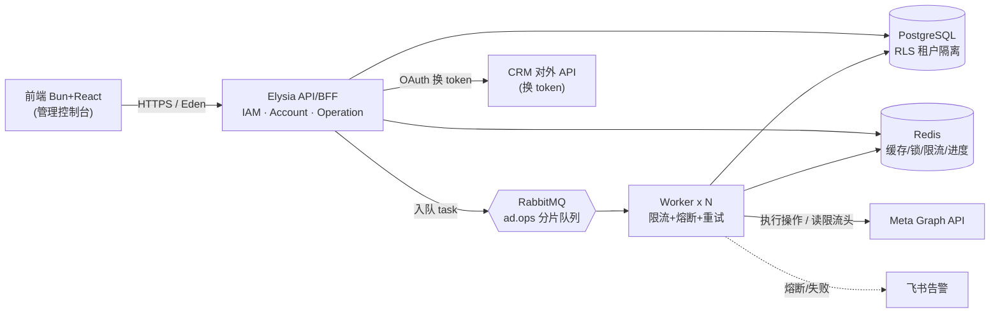
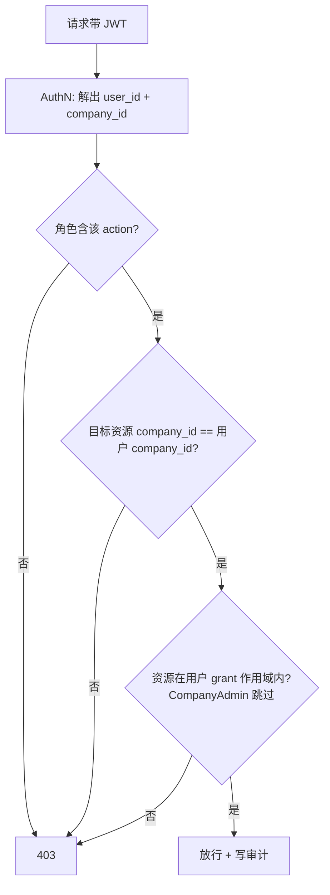
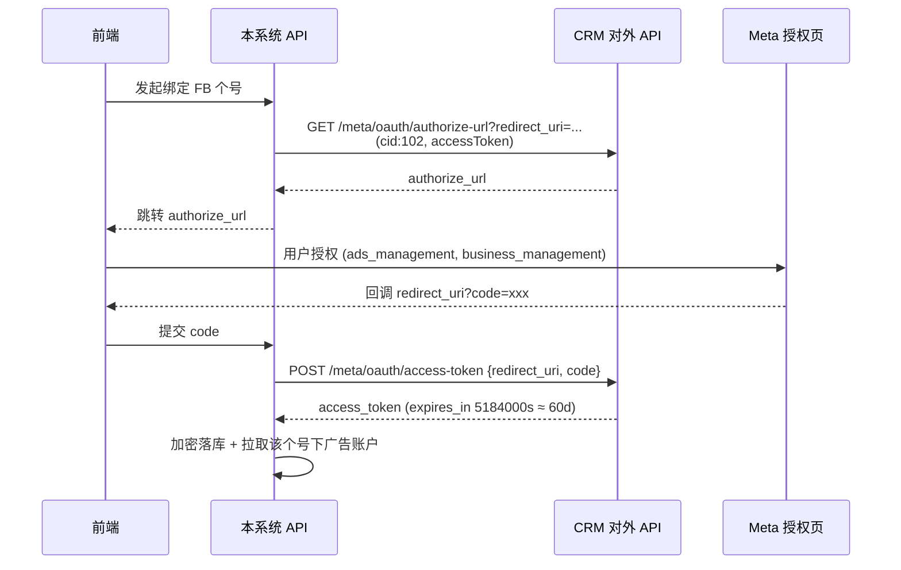

# FB 广告管理系统 · 架构设计 (MVP)

> 目标:基于 CRM 对外 API 获取 FB 个号 user token,构建多公司隔离、RBAC + 资源作用域的广告管理系统;承载 1000+ 广告账户的 **复制 / 开关 / 删除 / 控预算** 批量操作,要求快速响应、强扩展。

---

## 1. 核心设计决策

| 决策点 | 选择 | 理由 |
|---|---|---|
| 响应模型 | **API 同步入队 + Worker 异步执行** | 1000+ 账户操作打到 Meta Graph API 必受限流约束,API 必须秒级返回 `task_id`,真正执行交给 Worker。这是整个系统能"快速响应"的根本前提。 |
| 后端语言 | **Bun + Elysia (TypeScript)** | 与前端同语言;Eden 端到端类型安全;Elysia 吞吐高;瓶颈是 Meta 限流不是 CPU,无需上 Go。 |
| 架构形态 | **模块化单体** → 后期拆服务 | MVP 最快;模块边界清晰(IAM / Account / Operation),后期按模块平移成微服务零重写。 |
| 隔离粒度 | 公司(租户)= 硬隔离边界;FB 个号 = 授权作用域 | 与你的业务模型一致:公司 → FB 个号 → 广告账户。 |
| 限流策略 | RabbitMQ 按账户分片 + Redis 自适应令牌桶 | Meta 限流是 **按广告账户 (BUC)** 维度,分片到队列天然串行化每账户压力。 |

---

## 2. 技术栈

| 层 | 选型 |
|---|---|
| 前端 | Bun + React 19 + Vite + TanStack Router/Query + shadcn/ui;通过 **Elysia Eden** 直接吃后端类型 |
| 后端 API/BFF | Bun + Elysia(模块化单体) |
| Worker | Bun 进程,消费 RabbitMQ,可独立横向扩 |
| 数据库 | PostgreSQL 16(`company_id` + Row-Level Security 做租户隔离,JSONB 存 Meta 元数据) |
| ORM | Drizzle(Bun 原生支持,迁移友好) |
| 消息队列 | RabbitMQ(任务分发、优先级、重试、DLQ) |
| 缓存/锁/限流 | Redis(token 缓存、分布式锁、令牌桶、任务进度、权限缓存) |
| 实时进度 | SSE(MVP)/ 后期可换 WebSocket |
| 告警 | 飞书 Webhook(沿用你现有的 Feishu push 通道)|

---

## 3. 整体架构



请求流(批量开关 500 个 campaign 为例):
1. 前端发批量操作 → API 鉴权 + 作用域校验 → 落 `operation_tasks` 父任务 + N 个子项 → **立即返回 `task_id` (202)**。
2. 子项按 `ad_account_id` 哈希分片发到 RabbitMQ。
3. Worker 消费:取 Redis 令牌桶 → 调 Meta API → 读响应限流头自适应退避 → 写回结果 → 更新 Redis 进度。
4. 前端用 `task_id` 走 SSE 订阅进度。

---

## 4. 权限模型(多租户 + RBAC + 资源作用域)

### 4.1 三层模型

```
公司 (Company / 租户)  ── 硬隔离边界,跨公司绝对不可见
  └── 用户 (员工)
  └── FB 个号 (持 access_token)
        └── 广告账户 (Meta act_xxx)

授权关系:用户 ── 授予 ──> FB 个号(或具体广告账户)
          → 拿到该 FB 个号下全部已授权广告账户的访问权
```

权限 = **角色(能做什么 action)** × **作用域(能操作哪些资源)**。两者都满足才放行。

### 4.2 内置角色

| 角色 | 范围 | 说明 |
|---|---|---|
| PlatformAdmin | 平台级 | 跨公司运维,管理公司/IAM |
| CompanyAdmin | 公司级 | 管理本公司用户、FB 个号授权、所有广告账户 |
| Operator | 作用域内 | 对被授予的 FB 个号/广告账户执行操作 |
| Viewer | 作用域内 | 只读 |

### 4.3 权限项(`resource:action`)

| code | 含义 |
|---|---|
| `ad_account:read` | 查看广告账户/广告 |
| `campaign:status` | 开关(ACTIVE/PAUSED) |
| `campaign:budget` | 控预算 |
| `campaign:copy` | 复制 |
| `campaign:delete` | 删除/归档 |
| `iam:manage` | 管理用户与授权 |
| `fb_account:bind` | 绑定/授权 FB 个号 |

### 4.4 鉴权判定流程



> 用户有效权限与作用域缓存在 Redis `perm:{user_id}`(TTL 5min,授权变更主动失效),热路径不查库。

---

## 5. Token 获取与管理

### 5.1 OAuth 接入(对接你的 CRM API)



### 5.2 Token 存储与健康

| 项 | 方案 |
|---|---|
| 存储 | `fb_accounts.access_token_enc`,**AES-GCM 加密**,密钥放环境/KMS;严禁入日志、前端 |
| 缓存 | Redis `token:{fb_account_id}`,刷新加 `lock:token-refresh:{id}` 防并发 |
| 过期监控 | 定时任务扫 `token_expires_at`,**到期前 7 天飞书告警**,引导重新走 OAuth 重授权 |
| 失效处理 | Meta 调用返回 190/OAuthException → 标记个号 `token_invalid`,熔断该个号所有任务 + 告警 |

> 注意:CRM 返回的是用户级长效 token(60 天)。该 token 由 CRM 侧 App 签发,**续期需通过 CRM 重新授权**(文档未提供 refresh 端点)。MVP 按"到期前告警 + 重授权"处理;若后续 CRM 暴露 `fb_exchange_token` 续期,再接自动续期。

---

## 6. 广告操作流水线(系统核心)

### 6.1 RabbitMQ 拓扑

| 组件 | 设计 |
|---|---|
| Exchange | `ad.ops`(direct) |
| 分片 | routing key = `shard.{hash(ad_account_id) % N}`,**同一广告账户落同一队列** → 天然串行化、避免触发账户级限流 |
| 优先级 | 队列开 `x-max-priority`;控预算/暂停 = 高优,复制 = 低优 |
| 重试 | 失败 → DLX `ad.ops.dlx` → `ad.ops.retry`(消息 TTL 阶梯退避 5s/30s/2m)→ 回主队列;超 maxAttempts → `ad.ops.failed` |
| 幂等 | 子项带 `idempotency_key`,Worker 执行前查 Redis/DB 防重复 |

### 6.2 Redis 用途

| key | 用途 |
|---|---|
| `token:{fb_account_id}` | token 缓存 |
| `ratelimit:adacct:{act_id}` | 按广告账户令牌桶(自适应:读 Meta 响应头动态调速) |
| `ratelimit:app` | App 级全局桶 |
| `lock:target:{campaign_id}` | 操作锁,防同一对象并发改 |
| `task:{task_id}:progress` | 进度计数(total/success/failed),供 SSE |
| `perm:{user_id}` | 用户有效权限 + 作用域缓存 |

### 6.3 Meta Graph API 操作映射

| 操作 | 调用 |
|---|---|
| 开关 | `POST /{campaign_id}` body `status=ACTIVE\|PAUSED` |
| 控预算 | `POST /{campaign_id}`(CBO)或 `/{adset_id}` body `daily_budget` / `lifetime_budget` |
| 删除 | 软删 `status=ARCHIVED\|DELETED`,或 `DELETE /{id}` |
| 复制 | `POST /{campaign_id}/copies`(支持深拷 adset/ad) |

### 6.4 限流与熔断(对接你现有的 circuit-breaker)

- Worker 每次调用后解析 `X-Business-Use-Case-Usage` / `X-Ad-Account-Usage` 头,用量逼近阈值时**主动降速 / 暂停该账户分片**。
- 账户级熔断:连续失败/限流 → 熔断 N 分钟,期间任务回退队列等待。
- 全局熔断状态与计数放 Redis,所有 Worker 共享。

---

## 7. 数据库核心表

```sql
-- 租户
companies        (id, name, status, created_at)

-- IAM
users            (id, company_id, email, pwd_hash, status, created_at)
roles            (id, company_id NULL=平台级, code, name)
permissions      (id, code, resource, action)
role_permissions (role_id, permission_id)
user_roles       (user_id, role_id)

-- FB 资源
fb_accounts      (id, company_id, fb_user_id, name,
                  access_token_enc, token_expires_at, status, created_at)
ad_accounts      (id, fb_account_id, company_id, meta_act_id,
                  name, currency, status, last_synced_at)

-- 资源授权:员工 ↔ FB个号 / 广告账户
user_resource_grants (id, user_id, resource_type[fb_account|ad_account],
                      resource_id, granted_by, created_at)

-- 任务 & 审计
operation_tasks      (id, company_id, user_id, type, status,
                      total, success, failed, payload jsonb, created_at)
operation_task_items (id, task_id, ad_account_id, target_type, target_id,
                      action, idempotency_key, status, error, attempts)
audit_logs           (id, company_id, user_id, action, resource, detail, ip, created_at)
```

> 所有业务表带 `company_id`,开启 PG **Row-Level Security**,session 注入当前租户,DB 层兜底防越权。

---

## 8. 关键 API(节选)

| Method | Path | 说明 |
|---|---|---|
| POST | `/oauth/fb/authorize-url` | 取授权链接(代理 CRM 接口1) |
| POST | `/oauth/fb/callback` | 提 code 换 token(代理 CRM 接口2)并入库 |
| GET | `/ad-accounts` | 列出当前用户作用域内广告账户 |
| POST | `/operations/batch` | 批量操作,**返回 `task_id`(202)** |
| GET | `/operations/{task_id}` | 任务状态 |
| GET | `/operations/{task_id}/stream` | SSE 进度推送 |
| POST | `/iam/users/{id}/grants` | 给员工授予 FB个号/广告账户作用域 |

`POST /operations/batch` 请求体示例:
```json
{
  "action": "campaign:status",
  "params": { "status": "PAUSED" },
  "targets": [
    { "ad_account_id": "...", "target_type": "campaign", "target_id": "23851..." }
  ]
}
```

---

## 9. MVP 迭代路线

| 里程碑 | 内容 | 产出 |
|---|---|---|
| M1(1-2 周) | 多租户 + IAM + RBAC;OAuth 接 CRM 换 token;广告账户同步(只读) | 能登录、绑个号、看账户 |
| M2(+1 周) | 单账户操作(开关/预算)同步执行 + 审计日志 | 能操作 |
| M3(+1 周) | RabbitMQ + Redis 异步流水线;批量操作;令牌桶限流 + 重试/DLQ | 1000+ 账户批量、秒级响应 |
| M4(+1 周) | 复制/删除;SSE 进度;Token 健康监控 + 飞书告警;熔断 | 全功能 |
| M5 | 拆服务、Prometheus+Grafana 监控、ClickHouse 花费分析 | 生产化 |

---

## 10. 扩展性

| 维度 | 后期演进 |
|---|---|
| 服务拆分 | 模块化单体 → IAM / Account / Operation 独立服务,Worker 已独立 |
| 多平台 | Operation 抽象成 Provider 接口,新增 TikTok / Google Ads 只加适配器 |
| 可观测 | 加 Prometheus+Grafana(队列堆积、限流命中、任务时延) |
| 数据分析 | ClickHouse 存花费/操作流水做大盘 |
| 素材 | MinIO/S3 存创意素材(复制广告场景) |

---

## 待你确认的点
1. 前端 UI 框架是否接受 React(若你想用 Bun 全栈渲染如 Elysia + HTMX 也可,但 React 生态对管理后台更顺手)。
2. 复制操作是否需要跨账户/跨个号复制(涉及素材搬运,复杂度差异大)。
3. CRM 的 `cid` / `accessToken` 是平台级单一凭证,还是每公司一套?这影响多租户下 token 换取的隔离设计。
